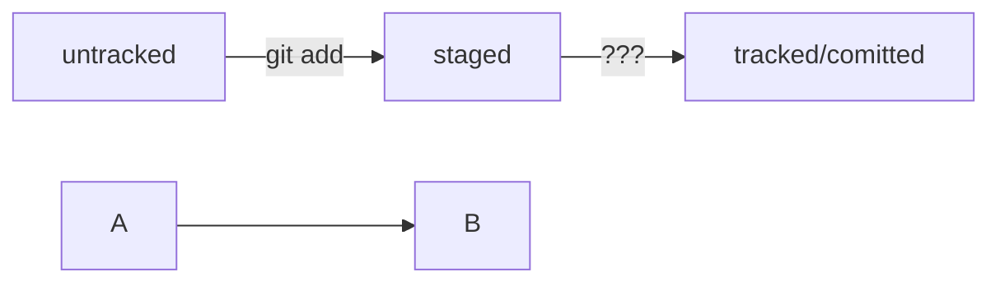

Инструкция для новичка в Git
Важные команды

GIT ADD ИМЯФАЙЛА #индексиреут файл для коммита
git commit -m "message" #производит коммит всех индексированных файлов
git push #добавляет на github

Хеш.

Таблица соответствия хеш → информация о коммите хранится в папке .git.
Основной идентификатор коммита — это его хеш.
Если посчитать хеш одного и того же файла (одним и тем же алгоритмом) на двух разных компьютерах, то результат будет гарантированно одинаковым.
Все хеши, а также таблицу соответствий хеш → информация о коммите Git хранит в папке .git.

Элементы описания коммита
После вызова git log появляется список коммитов.

Получить сокращённый лог — git log --oneline
Получить сокращённый лог можно с помощью команды git log с флагом --oneline (англ. «одной строкой»). В терминале появятся только первые несколько символов хеша каждого коммита и их комментарии.

Изменения в коммитах.
--amend рассчитан на работу с последним коммитом (HEAD).
Дополнить коммит новыми файлами можно с помощью git commit --amend --no-edit. Благодаря опции --no-edit сообщение к коммиту останется таким, каким и было.
Изменить сообщение к коммиту позволяет команда git commit --amend -m "Обновлённое сообщение коммита".

Практика использования --amend
